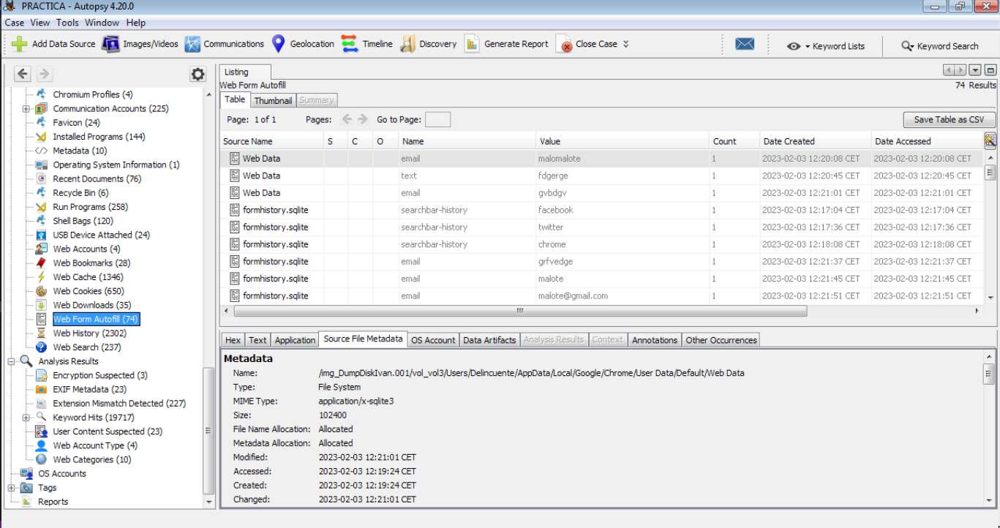
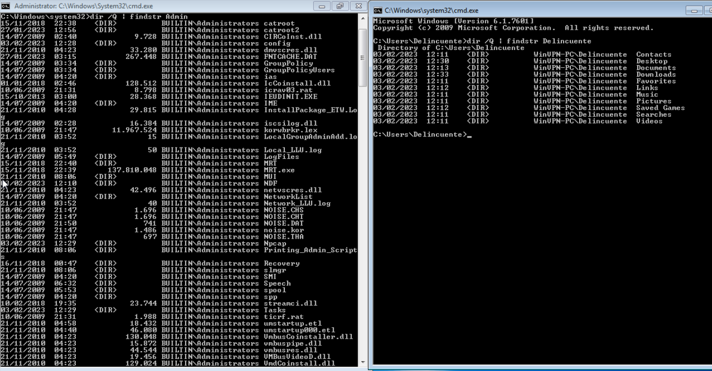

# **SAD Práctica 7**
# Informática Forense
#### Realizado por: **Iván Piña Castillo**

----------------------------------------------------------------------------------------------------------------------------

```
La informática forense es el conjunto de técnicas que nos permite obtener la máxima información posible tras un incidente o delito informático.
```

----------------------------------------------------------------------------------------------------------------------------

En esta práctica, realizaré la fase de toma de evidencias y análisis de las mismas sobre una máquina Linux y otra Windows. Supondremos que pillamos al delincuente in fraganti y las máquinas se encontraban encendidas. Opcionalmente, podré realizar el análisis de un dispositivo Android.

Sobre cada una de las máquinas debo realizar un volcado de memoria y otro de disco duro, tomando las medidas necesarias para certificar posteriormente la cadena de custodia.

----------------------------------------------------------------------------------------------------------------------------

Para esta práctica, el profesor nos ha indicado numerosas herramientas que podemos utilizar para realizar el análisis de las máquinas:

- Algunos kits de herramientas forenses open-source:
```
Caine
DFF (Digital Forensics Framework)
The Sleuth Kit
Helix Live CD
Digital Evidence and Forensics Toolkit (DEFT)
```

- Para análisis de memoria:
```
Volatility
Access Data FTK Imager
MDD
```

- Para análisis de registro de Windows:
```
AccessData Registry Viewer
Kape
Fred (Forensic Registry Editor)
```

- Para análisis de discos duros:
```
Autopsy
```

- Herramientas gratuitas para Android:
```
AFLogical OSE
OSAF (Open Source Android Forensics)
Andriller
ADEL (Android Data Extractor Lite)
WhatsApp Xtract
Skype Xtractor
Android Pattern Lock Cracker
```

----------------------------------------------------------------------------------------------------------------------------

```
Debo tratar de obtener las siguientes informaciones haciendo uso de las herramientas anteriormente mencionadas:
```

----------------------------------------------------------------------------------------------------------------------------

## Instalación de Autopsy

Primero instalaremos **Autopsy** en nuestra máquina Windows que utilizaremos para realizar el análisis de la máquina del Criminal.
El proceso de instalación es muy sencillo, solo tendremos que descargar el instalador de la página oficial de autopsy y ejecutarlo.

Para crear el caso, también es muy sencillo, acontinuación, se muestra la captura de pantalla de la creación del caso (para este ejemplo lo haré sobre el caso de la maquina Windows del criminal):

- Hacemos clic en “New Case” para crear un nuevo caso:

    

- A continuación, rellenamos toda la información necesaria del caso, como el nombre del mismo, y eligimos un directorio base para guardar todos los datos del caso en un solo lugar:

    

- También podemos añadir información adicional opcional sobre el caso si es necesario:
  
    

- Ahora vamos a añadir el tipo de fuente de datos. Hay varios tipos para elegir.

        - Disk Image or VM file: Esto incluye el archivo de imagen que puede ser una copia exacta de un disco duro, una tarjeta multimedia o    incluso una máquina virtual.
  
        - Local Disk: Esta opción incluye dispositivos como discos duros, pen drives, tarjetas de memoria, etc.
        
        - Logical Files: Incluye la imagen de cualquier carpeta o archivo local.
        
        - Unallocated Space Image File: Incluyen archivos que no contienen ningún sistema de archivos y se ejecutan con la ayuda del módulo      Ingest.
        
        - Autopsy Logical Imager Results: Incluyen la fuente de datos de la ejecución del generador de imágenes lógicas.
        
        - XRY Text Export: Incluyen la fuente de datos de la exportación de archivos de texto desde XRY.
  
    

- Ahora vamos a añadir la fuente de datos. En este caso, añadiremos la imagen de disco de la máquina Windows del criminal:
  
    

- A continuación, se te pedirá que configures el módulo Ingest:
  
    

- Y finalmente, esperamos a que se termine de indexar la fuente de datos:
  
    


----------------------------------------------------------------------------------------------------------------------------

## Instalación de Volatility

También, instalaremos **Volatility** en nuestra máquina debian que utilizaremos para realizar el análisis de la máquina del Criminal, para ello, ejecutaremos el siguiente comando para descargar el repositorio de Volatility:
```bash
git clone git clone https://github.com/volatilityfoundation/volatility3.git
```

Crearemos un entorno virtual para poder instalar las dependencias de volatility:
```bash
python3 -m venv entorno
```

Activaremos el entorno virtual:
```bash
source entorno/bin/activate
```

Instalaremos las dependencias de volatility:
```bash
pip3 install -r requirements.txt
```

Acto seguido, haremos un build de volatility:
```bash
python3 setup.py build
```

Y finalmente, instalaremos volatility:
```bash
python3 setup.py install
```

----------------------------------------------------------------------------------------------------------------------------

## A) Máquina Windows.

----------------------------------------------------------------------------------------------------------------------------

## Volcado de Memoria en Windows

Para realizar el volcado de memoria en Windows, he utilizado la herramienta AccessData FTK Imager.

Su instalación es muy sencillo, solo tendremos que descargar el instalador de la página oficial de FTK Imager y ejecutarlo.

Para realizar el volcado de memoria, también es muy sencillo, acontinuación, se muestra la captura de pantalla del volcado de memoria:

- Una vez abierta la herramienta, hacemos clic en “File”:

    

- Hecho esto, hacemos clic en “Capture Memory”:

    

- Rellenamos toda la información necesaria del volcado de memoria, como el nombre del mismo, y elegimos un directorio base para guardar todos los datos del volcado de memoria en un solo lugar:

    

- Ya solo nos queda esperar a que se termine de realizar el volcado de memoria:

    


----------------------------------------------------------------------------------------------------------------------------

## Volcado de Disco en Windows

Seguiremos usando la herramienta AccessData FTK Imager para realizar el volcado de disco de la máquina Windows del criminal.

Para realizar el volcado de disco, también es muy sencillo, acontinuación, se muestra la captura de pantalla del volcado de disco:

- Una vez abierta la herramienta, hacemos clic en “File” y en “Capture Disk Image”:

    

- Rellenamos toda la información necesaria del volcado de disco, como el nombre del mismo, y elegimos un directorio base para guardar todos los datos del volcado de disco en un solo lugar:

    

    

    

    

    

    

    

- Ya solo nos queda esperar a que se termine de realizar el volcado de disco:

    

----------------------------------------------------------------------------------------------------------------------------

### 1. Procesos en ejecución.
Para ver los procesos en ejecución, utilizaremos la herramienta volatility, para ello, ejecutaremos el siguiente comando:
```bash
python vol.py -f "/home/ivan/Documentos/Seguridad/tema4/VolcadoRAM/memdump.mem" windows.pslist.PsList
```


### 2. Servicios en ejecución.
Para ver los servicios en ejecución, utilizaremos la herramienta volatility, para ello, ejecutaremos el siguiente comando:
```bash
python vol.py -f "/home/ivan/Documentos/Seguridad/tema4/VolcadoRAM/memdump.mem" windows.getservicesids.GetServiceSIDs
```


### 3. Puertos abiertos.
Para ver los puertos abiertos, utilizaremos la herramienta volatility, para ello, ejecutaremos el siguiente comando:
```bash
python vol.py -f "/home/ivan/Documentos/Seguridad/tema4/VolcadoRAM/memdump.mem" windows.netstat.NetStat
```


### 4. Conexiones establecidas por la máquina.
Para ver las conexiones establecidas por la máquina, utilizaremos la herramienta volatility, para ello, ejecutaremos el siguiente comando:
```bash
python vol.py -f "/home/ivan/Documentos/Seguridad/tema4/VolcadoRAM/memdump.mem" windows.netscan.NetScan
```


### 5. Sesiones de usuario establecidas remotamente.
Para ver las sesiones de usuario establecidas remotamente, utilizaremos la herramienta volatility, para ello, ejecutaremos el siguiente comando:
```bash
python vol.py -f "/home/ivan/Documentos/Seguridad/tema4/VolcadoRAM/memdump.mem"  windows.sessions.Sessions
```


### 6. Ficheros transferidos recientemente por NetBios.

### 7. Contenido de la caché DNS.

### 8. Variables de entorno.
Para ver las variables de entorno, utilizaremos la herramienta volatility, para ello, ejecutaremos el siguiente comando:
```bash
python vol.py -f "/home/ivan/Documentos/Seguridad/tema4/VolcadoRAM/memdump.mem" windows.envars.Envars
```


### 9. Dispositivos USB conectados
Para ver los dispositivos USB conectados, utilizaremos la herramienta Autopsy:


### 10. Redes wifi utilizadas recientemente.


### 11. Configuración del firewall de nodo.


### 12. Programas que se ejecutan en el Inicio.


### 13. Asociación de extensiones de ficheros y aplicaciones.
Para ver la asociación de extensiones de ficheros y aplicaciones, utilizaremos la herramienta Autopsy:

- En la sección “File Types” encontraremos la información:
  
    

- Podemos ver los archivos con extensión de imagen por ejemplo:
  
    

- También podemos ver los archivos con extensión de archivo:
  
    

- También podemos ver los archivos con extensión de base de datos:
  
    

- También podemos ver los archivos con extensión de HTML:

    

- Como último ejemplo, podemos ver los archivos con extensión de ejecutable exe:
  
    

### 14. Aplicaciones usadas recientemente.

Para obtener información sobre las aplicaciones usadas recientemente, utilizaremos la herramienta Autopsy:


También podemos verlo en esta sección:


### 15. Ficheros abiertos recientemente.
Para ver los ficheros abiertos recientemente, utilizaremos la herramienta Autopsy:


### 16. Software Instalado.

Para ver el software instalado, utilizaremos la herramienta Autopsy:


### 17. Contraseñas guardadas.
Para las contraseñas de navegadores, usaré la herramienta Autopsy:


Para las contraseñas de los usuarios, usaré la herramienta Autopsy:



### 18. Cuentas de Usuario

Para ver las cuentas de usuario, utilizaremos la herramienta Autopsy:


### 19. Historial de navegación y descargas. Cookies.

Para el historial de navegación, usaré la herramienta Autopsy:

- En Web History, veremos el historial de navegación:

    

- En Web Search, veremos las búsquedas realizadas:

    

Para las cookies, usaré la herramienta Autopsy:


Para las descargas, usaré la herramienta Autopsy:


### 20.  Volúmenes cifrados

### 21. Archivos con extensión cambiada.

Para ver los archivos con extensión cambiada, utilizaremos la herramienta Autopsy:


--


### 22. Archivos eliminados.

Para ver los archivos eliminados, utilizaremos la herramienta Autopsy:

- Aquí podemos ver los archivos eliminados de la papelera de reciclaje:
  
    

- Aquí podemos ver los archivos eliminados del disco duro:
  
    

### 23. Archivos Ocultos.

### 24. Archivos que contienen una cadena determinada.

Para ver los archivos que contienen una cadena determinada, utilizaremos la herramienta Autopsy:


### 25. Búsqueda de imágenes por ubicación.

Para ver las imágenes por ubicación, utilizaremos la herramienta Autopsy:

- Pondremos que nos muestre las ubicaciones de todas las imágenes posibles con geolocalización, el filtro nos muestra tres ubicaciones:

    

- Estas tres ubicaciones se encuentran en Italia:

    

- Ubicación de la imagen 1:

    

- Ubicación de la imagen 2:

    

- Ubicación de la imagen 3:

    

### 26. Búsqueda de archivos por autor.

Para ver los archivos por autor, utilizaremos la herramienta Autopsy:



----------------------------------------------------------------------------------------------------------------------------

## Apartado B) Máquina Linux.

----------------------------------------------------------------------------------------------------------------------------

## Volcado de Memoria en Linux

Para realizar el volcado de memoria en Linux, utilizaremos ls herramienta Lime:
```bash
# Clonamos el repositorio de Lime
git clone https://github.com/504ensicsLabs/LiME.git

# Compilamos el módulo de Lime
cd LiME/src
make

# Cargamos el módulo de Lime
insmod lime-5.10.0-21-amd64.ko "path=/mnt/memoria/memoriaLinux.mem format=lime"

# Para desmontar el módulo de Lime
rmmod lime-5.10.0-21-amd64.ko
```


----------------------------------------------------------------------------------------------------------------------------

## Volcado de Disco en Linux

Para realizar el volcado de disco en Linux, utilizaremos el comando dd:
```
dd if=/dev/sda1 of=/mnt/disco/discoLinux.iso bs=64K
```


----------------------------------------------------------------------------------------------------------------------------

### 1. Procesos en ejecución.

### 2. Servicios en ejecución.

### 3. Puertos abiertos.

### 4. Conexiones establecidas por la máquina.

### 5. Sesiones de usuario establecidas remotamente.

### 6. Ficheros transferidos recientemente por NetBios.

### 7. Contenido de la caché DNS.

### 8. Variables de entorno.

### 9. Dispositivos USB conectados

### 10. Redes wifi utilizadas recientemente.

### 11. Configuración del firewall de nodo.

### 12. Programas que se ejecutan en el Inicio.

### 13. Asociación de extensiones de ficheros y aplicaciones.

### 14. Aplicaciones usadas recientemente.

### 15. Ficheros abiertos recientemente.

### 16. Software Instalado.

### 17. Contraseñas guardadas.

### 18. Cuentas de Usuario

### 19. Historial de navegación y descargas. Cookies.

### 20. Volúmenes cifrados

### 21. Archivos con extensión cambiada.

### 22. Archivos eliminados.

### 23. Archivos Ocultos.

### 24. Archivos que contienen una cadena determinada.

### 25. Búsqueda de imágenes por ubicación.

### 26. Búsqueda de archivos por autor.

----------------------------------------------------------------------------------------------------------------------------

## Apartado C) Dispositivo Android.

### - Hacer un volcado de memoria y recuperar:

1. Información de ubicación.
2. Información de llamadas.
3. Información de mensajes.
4. Información de aplicaciones de mensajería.
5. Información de perfiles en redes sociales.

